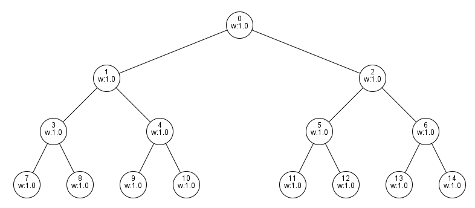

# IRQ - Feedback Vertex Set

<pre>
    ,---,.                              .--.--.    
  ,'  .' |               ,---.         /  /    '.  
,---.'   |              /__./|        |  :  /`. /  
|   |   .'         ,---.;  ; |        ;  |  |--`   
:   :  :          /___/ \  | |        |  :  ;_     
:   |  |-,        \   ;  \ ' |         \  \    `.  
|   :  ;/|         \   \  \: |          `----.   \ 
|   |   .'          ;   \  ' .          __ \  \  | 
'   :  '             \   \   '         /  /`--'  / 
|   |  |              \   `  ;        '--'.     /  
|   :  |               :   \ |          `--'---'   
|   | ,'                '---"                      
`----'                                             
                                                   
- - - - - - - - - - - - - -
Feedback Vertex Set
</pre>

This project compares algorithms for the [Feedback Vertex Set](https://en.wikipedia.org/wiki/Feedback_vertex_set) for vertex-weighted graphs.

See [report.pdf](report.pdf) to see a detailed report about featured algorithms.  
This document describes how to use and test the given java programs.

Disclaimer: This project was created for a course taken at the University of Constance.

# <ins>**Step 1: Prerequisites**</ins>

**We recommend using Java 17.0.1 since we tested everything on it.**

### Download or copy the fvs directory

### Open console and change directory to the fvs directory

### Compile java files

To compile all of the java files simply type `javac *.java` in the console.

# <ins>**Step 2: Test on graphs**</ins>

### We are considering the following vertex-weighted graphs:

|       Graph 1            |        Graph 2           |         Graph 3          |       Graph 4       |
| ------------------------ | ------------------------ | ------------------------ | --------------------|
|  |  |  |  |

|       Graph 5            |        Graph 6           |         Graph 7          |       Graph 8          |
| ------------------------ | ------------------------ | ------------------------ | ---------------------- |
|  |  |  |  |

Note that graph 1 is an empty graph.

### Try the algorithms on the graphs with:

   `java FeedbackVertexSet <pathToGraph>`

E.g.: `java FeedbackVertexSet "graphs\\graph1.graph"`

# <ins>**Step 3: Try it on your own graphs**</ins>

**This is completely optional.**

### Open GUI

   type `java Tester` in the console

### Create graphs

   Follow the instructions on top of the window to create a graph

### Try the algorithms

   By clicking on the buttons on the right side the respective algorithm solves the FVS for the graph.

   Solution will be displayed on the bottom and all vertices of the solution get a red border.

